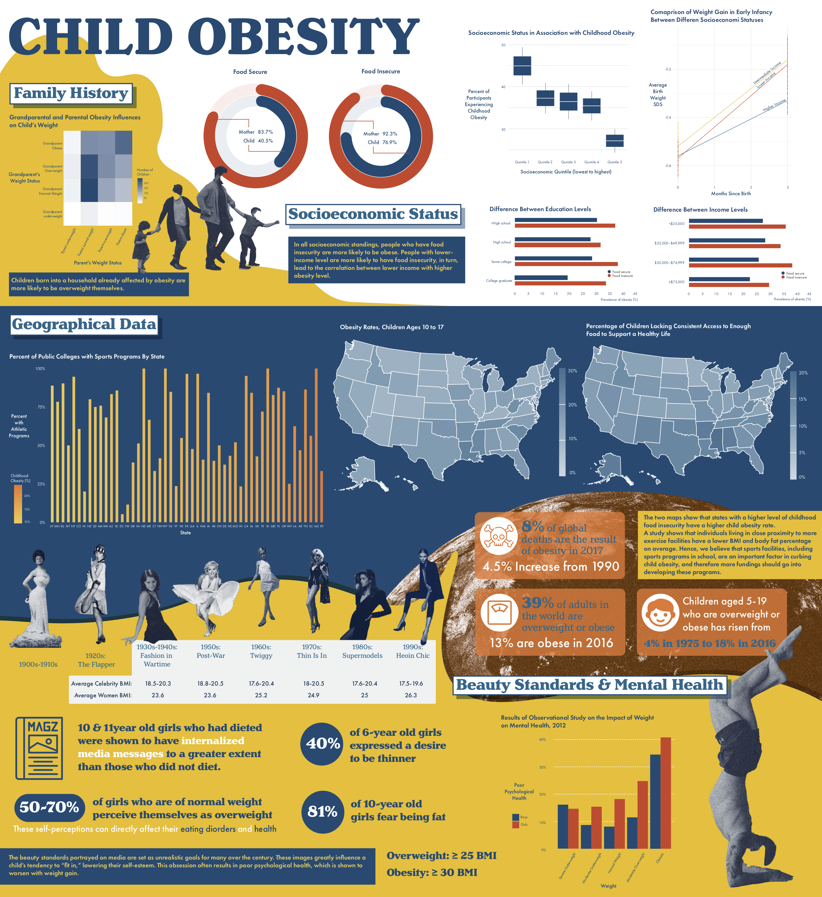

# Viz-a-thon-2021

As a team of 3, together we collected data on a wide range of health, demographic, and policy topics, cleaned data in various formats (csv, spreadsheets), visualized correlation, geographical, time series data between variables on the interactive platform R Shiny.

## ***Link to the interactive shiny app***: https://vizathon.shinyapps.io/viz-a-thon-2021-main/
 
INFOGRAPHICS:

